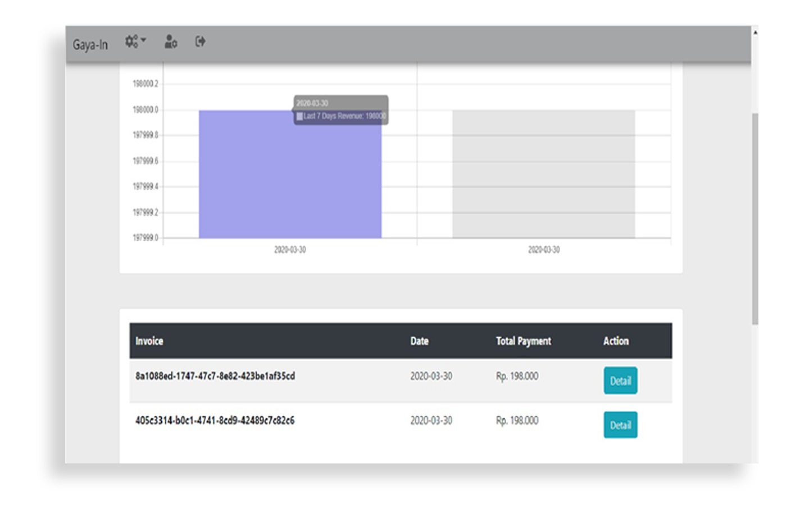
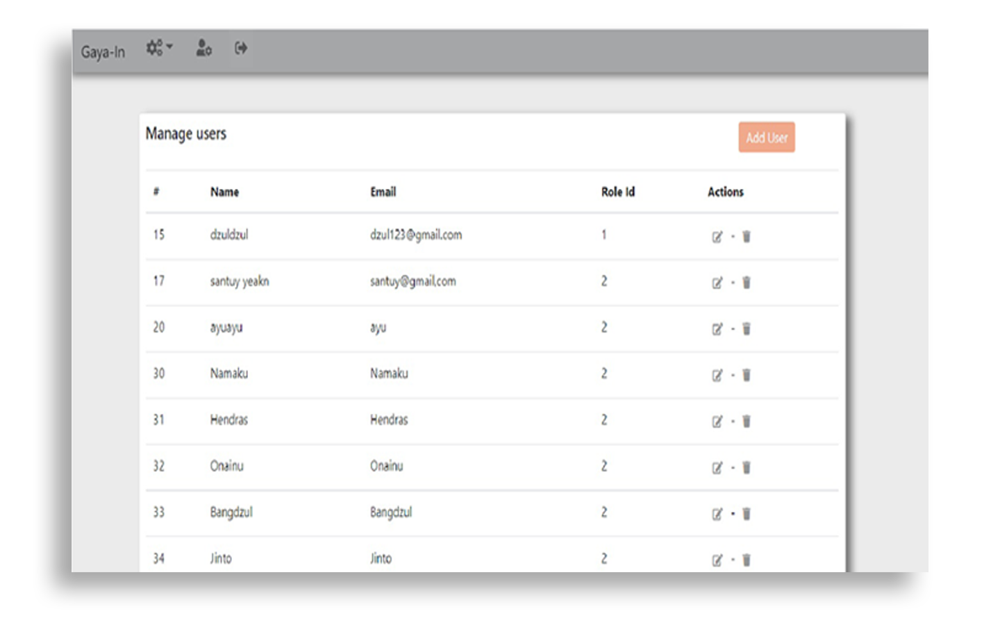

<h1 align="center">
  <a href="http://gayainweb.s3-website-us-east-1.amazonaws.com">
  </a>
</h1>

<p align="center">
  <a href="https://github.com/facebook/react/blob/master/LICENSE">
    
  </a>
  <a href="https://circleci.com/gh/facebook/react-native">
    
  </a>
  <a href="https://www.npmjs.org/package/react>
    
  </a>
  <a href="https://reactnative.dev/docs/contributing">
    
  </a>
</p>

## SCREENSHOOT DEMO
- <b>History Statistic</b>


- <b> Manage Uer </b>



## DEMO


## Table Of Contents
*  [Intro](#Intro)
*  [Requirments](#Requirments)
*  [Related Projects](#Related-Projects)
*  [Dependencies](#Dependencies)
    *  [Clone Repo](#Clone-Repo)
    *  [Install Depedencies](#Install-Depedencies)
    *  [Update Depedencies](#Update-Depedencies)
    *  [Setup Environment](#Setup-Environment)
    *  [Run server development](#Run-server-development)
    *  [Build For Production](#Build-For-Production)
* [Dependencies](#Dependencies)
* [License](#License)
___
### Intro

Gayain is an e-commerce application collaboration project with the team at the Arkcademy bootcamp.
Gayain includes web and mobile platforms. Mobile applications are used for marketing,
while for the web platform it is used for product, user, and category management.
This application was built with React and React native, shipping gateway using the API
rajaongkir

___
### Features
- [x] Manage Product (CRUD)
- [x] Manage Category (CRUD)
- [x] Manage User (CRUD)
- [x] Chart statistics of Revenue
- [x] History of order, weekly, and detail history
- [x] Authentication with JWT in backend
- [x] Persist and rehydrate a redux store
___
### Requirments

* [Nodejs](https://nodejs.org/en/) v10 LTS version
* [Npm](https://www.npmjs.com/get-npm) package / [Yarn](https://yarnpkg.com/lang/en/docs/install/#mac-stable) package
___

### Related Projects
This project is related to several platforms

* Backend [https://github.com/gayain/gayaIn-Backend](https://github.com/gayain/gayaIn-Backend)
* Mobile App [https://github.com/gayain/gayaIn-frontend-Mobile](https://github.com/gayain/gayaIn-frontend-Mobile)
___

### Installation

##### 1. Clone Repo
clone the repository

```sh
$ git clone https://github.com/gayain/gayaIn-Frontend-Web
$ cd gayaIn-Frontend-Web
```

##### Install Depedencies

```sh
$ npm install
```

##### Update Depedencies

```sh
$ npm update
```

##### Setup Environment
Before project development or build for production, you should create new .env file, edit REACT_APP_URL variable to backend server. you can found the backend server here.. [https://github.com/gayain/gayain-Backend](https://github.com/gayain/gayain-Backend)

```sh
REACT_APP_URL=<Backend-api-url>
```

##### npm development
if you want start on development mode.

```sh
$ npm start
```


##### Build For Hosting in Server
build for production ready, and host ready

```sh
$ npm run build
```
___

### Dependencies

List of depedencies using in this project

| Plugin | Description |
| ------ | ------ |
| [React](https://facebook.github.io/react-native/) | Web Framework |
| [Axios](https://github.com/axios/axios) | HTTP client for request API |
| [Chartjs](https://www.npmjs.com/package/chart.js?activeTab=readme) | Chart Statistic |
| [Redux](https://redux.js.org) | Global State Management |
| [Redux Promise Middleware](https://www.npmjs.com/package/redux-promise-middleware) | Promise handler for react redux 
| [Redux Persist](https://www.npmjs.com/package/redux-persist) | Persist and rehydrate a redux store
| [Dot Env](https://www.npmjs.com/package/dotenv) | Dot Env

License
----

MIT


@2020 - gayaIn Team
